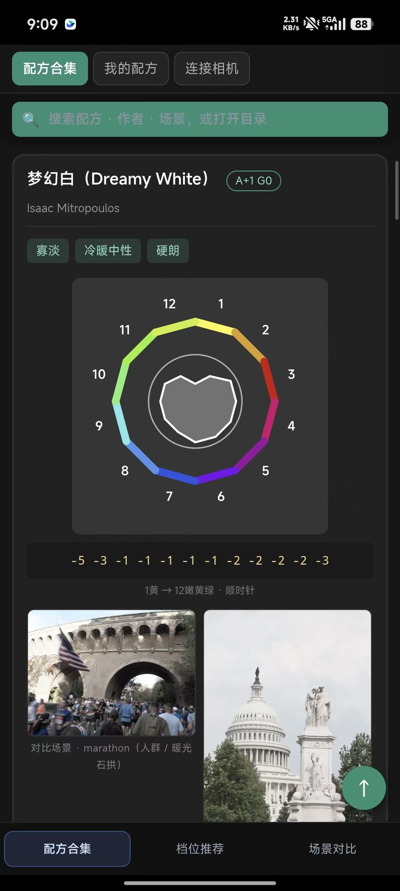
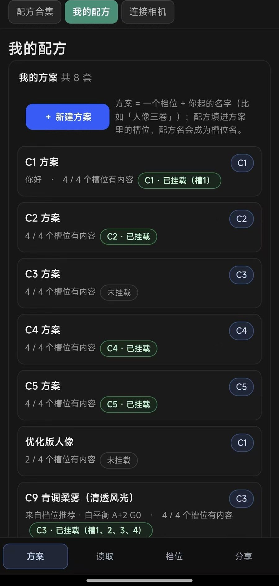
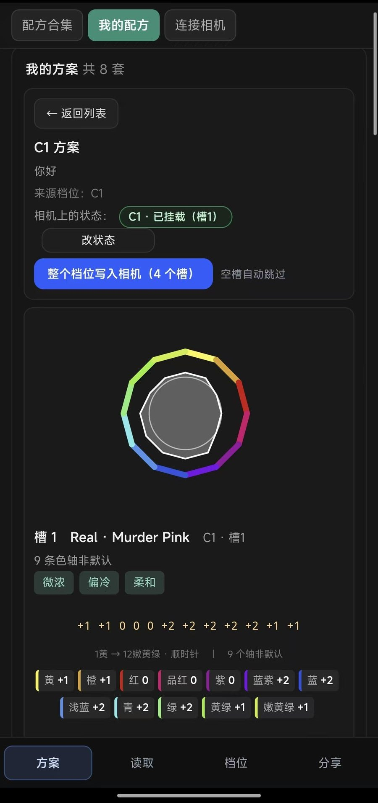
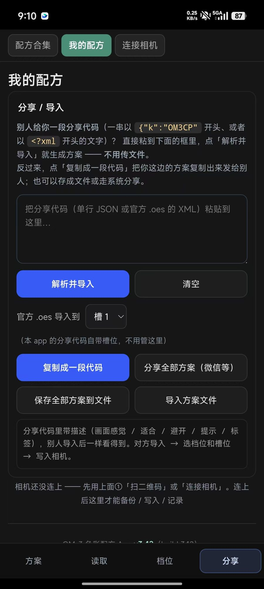

# om3 recipes tool

把 **80 条 OM-3 / OM System 彩色配方**装进手机：能离线查、能按场景挑、能直接写进相机。

> Android App（WebView + 单页 HTML）+ 一套自己写的相机连接功能。
> 全部离线：一个 HTML 文件，界面、图片、字体都内嵌，不联网、不收集任何东西。

  
   
  
  

<!-- 还差两张，拍好放进 screenshots/ 再去掉这段注释：
     ① 配方合集首页 → screenshots/recipes.jpg（用**最新版** App 截，标题才是 om3 recipes tool）
     ② 连接相机页 → screenshots/connect.jpg

 

-->

## 它能干什么

- **配方合集**：80 条配方，按**白平衡签名**排成一条色带（A2 G1、A1 G1、A4 M1 …），一眼看出"偏暖/偏冷/不偏移"；
  可按配方名、作者、场景搜索，也可按"人像 / 婚礼 / 风光 / 花卉 / 夜景"这类场景挑。
- **每条配方都写全**：12 轴色轮数值 + 色调曲线（高光/中间调/暗部）+ 阴影补偿 / 锐度 / 对比 / 曝光 +
  白平衡偏移，外加上作者样片、EXIF、参数解读和"适合 / 避开"。
- **我的方案**：把自己挑的几条组成一套，按顺序写进相机的 C1–C4；**方案名随时能改**（列表上直接改，不用进详情）。
- **连接相机**：手机直连相机 Wi-Fi（**手填 SSID / 密码**，相机屏幕上就写着），检测相机、**把配方写进相机**、把整套方案写进去。
- **不装相机官方 App 也能用**；换手机、没网络都能用。

## 下载

**⬇ [om3-recipes-tool-v3.48.apk](../../releases/download/v3.48/om3-recipes-tool-v3.48.apk)** —— 75.7 MB，Android 8.0+

也可以到 [Releases](../../releases) 看全部版本。签名固定，以后新版本**直接覆盖升级**，数据不会丢。

> 也支持纯浏览器用：仓库里的 `app/base.html` 就是完整手册，双击用浏览器打开即可
> （**连接相机**和**我的配方 / 我的方案**这两块只在 App 里可用 —— 它们要用到手机的原生能力）。

## 怎么用（连相机三步）

1. **相机上开 Wi-Fi**：`MENU → Wi-Fi/蓝牙 → 连接到智能手机`（相机会显示 SSID / 密码 / 二维码）。
2. **App 里点「连接相机」**：忘了密码就「连不上？更多方式 → 手动填 SSID / 密码」（相机屏幕上写着这两个值）。
3. **检测相机 → 导入配方 / 写配方**：进「连接相机」页按提示走，写完在相机上选 C1–C4 就能拍。

> ⚠️ App **不会**替你开相机 Wi-Fi（那是有副作用的动作，得你点头）；相机 Wi-Fi 请自己在相机上开。

## 常见问题

| 现象 | 怎么办 |
|---|---|
| 连不上 / 一直转圈 | 右上角 `☰` → **测试页** → 「分享日志」把日志发出来（里面写了每一步的结论） |
| 忘了相机 Wi-Fi 密码 | 相机 `MENU → Wi-Fi/蓝牙 → 连接到智能手机` 会显示；App 里「连不上？更多方式 → 手动填 SSID / 密码」填一次就记住 |
| 写进相机没反应 | 确认相机在**传输/连接状态**（屏幕上有显示），再点一次 |

## 配方来源与致谢

配方数值与作者自述来自 [om-recipes.com](https://om-recipes.com) 及各位作者（Rob Trek、Ali O'Keefe、Robson Cabanas 等），
样片版权归原作者，本工具只做整理与参数换算，方便在相机上直接照抄。

## 想自己编译？

`apk/build.sh`（aapt2 + javac + d8 + zipalign + apksigner）；页面真源是 `app/base.html`。

## 许可

个人项目，自用为主。配方与样片版权归原作者；引用请注明来源。

---

**喜欢这个手册？在 App 右上角点 ⭐，或直接来 GitHub 给个 Star —— 免费、无广告，Star 能让更多拍胶片的人搜到它。**
